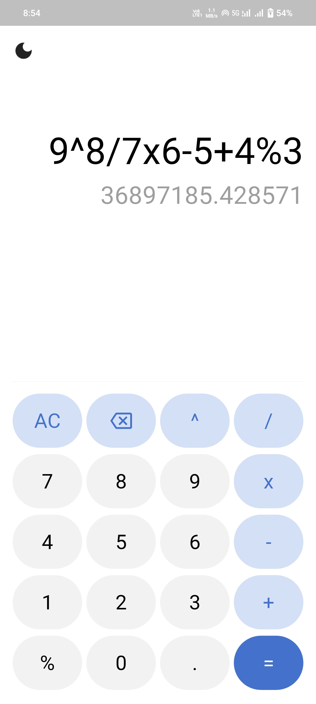
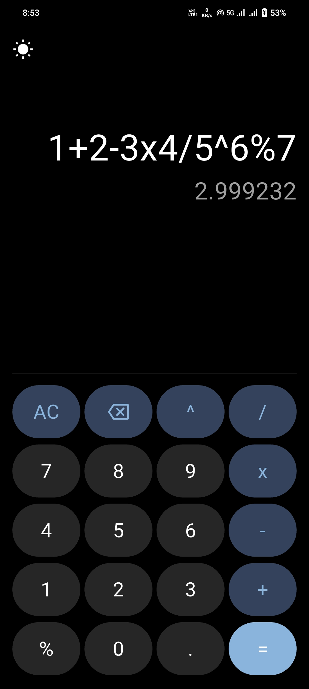

# 🧮 Calculator App

A modern **Flutter calculator app** with beautiful UI, dark/light theme support, and advanced mathematical operations. Built with clean architecture, state management, and responsive design.

This project is perfect for Flutter developers looking to explore state management, custom UI components, theme switching, and mathematical expression evaluation.

---

## 🚀 Features

- 🧮 **Advanced Calculator**: Support for basic arithmetic, exponents, percentages, and complex expressions
- 🌙 **Dark/Light Theme**: Beautiful theme switching with smooth animations
- 📱 **Responsive Design**: Optimized for all screen sizes with adaptive layouts
- ✨ **Smooth Animations**: Animated theme toggle and button interactions
- 🎨 **Custom UI**: Beautiful Material Design with custom color schemes
- 🔄 **State Management**: Clean architecture using Provider pattern
- 💾 **Persistent Themes**: Theme preference saved locally
- 🎯 **Error Handling**: Robust error handling for invalid expressions

---

## 📸 Screenshots

| Light Theme | Dark Theme |
|-------------|------------|
|  |  |

---

## 🎥 Demo

📽️ [Watch Demo Video](assets/output/calculator_output.mp4)

---

## 🗂️ Project Structure

```
lib/
├── main.dart                      # App entry point with providers
├── constants/
│   └── colors.dart               # Custom color definitions
├── providers/
│   ├── calculator_provider.dart  # Calculator logic and state
│   └── theme_provider.dart       # Theme management
├── screens/
│   ├── splash_screen.dart        # Animated splash screen
│   └── calculator_screen.dart    # Main calculator interface
└── widgets/
    └── custom_button.dart        # Reusable button component
```

---

## 📦 Dependencies

```yaml
dependencies:
  flutter:
    sdk: flutter
  cupertino_icons: ^1.0.8
  math_expressions: ^2.7.0      # Mathematical expression evaluation
  provider: ^6.1.5              # State management
  shared_preferences: ^2.2.2     # Local storage for theme persistence
```

Install dependencies:

```bash
flutter pub get
```

---

## 🛠️ Getting Started

1. **Clone the repository**
   ```bash
   git clone https://github.com/your-username/calculator-app.git
   cd calculator-app
   ```

2. **Install dependencies**
   ```bash
   flutter pub get
   ```

3. **Run the app**
   ```bash
   flutter run
   ```

> Ensure you have [Flutter installed](https://flutter.dev/docs/get-started/install) and a device/emulator ready.

---

## 🎯 Key Features Explained

### 🧮 Mathematical Operations
- **Basic Operations**: Addition (+), Subtraction (-), Multiplication (×), Division (/)
- **Advanced Operations**: Exponentiation (^), Percentage (%)
- **Decimal Support**: Full decimal number support
- **Expression Evaluation**: Complex mathematical expressions with proper operator precedence

### 🌙 Theme System
- **Light Theme**: Clean, modern light interface
- **Dark Theme**: Elegant dark interface with custom colors
- **Smooth Transitions**: Animated theme switching with rotation effects
- **Persistent Storage**: Theme preference saved using SharedPreferences

### 📱 Responsive Design
- **Adaptive Layout**: Works seamlessly on phones and tablets
- **Dynamic Sizing**: Buttons and text scale based on screen size
- **Portrait Lock**: Optimized for portrait orientation
- **Safe Area**: Proper handling of device notches and system UI

---

## 🏗️ Architecture

### State Management
- **Provider Pattern**: Clean separation of business logic and UI
- **CalculatorProvider**: Manages calculator state and operations
- **ThemeProvider**: Handles theme switching and persistence

### Widget Structure
- **Custom Components**: Reusable `CustomButton` widget
- **Responsive Layout**: Dynamic sizing based on screen dimensions
- **Clean UI**: Material Design principles with custom styling

### Error Handling
- **Expression Validation**: Robust error handling for invalid inputs
- **User Feedback**: Clear error messages for invalid expressions
- **Input Validation**: Prevents invalid operator sequences

---

## 📌 Use Cases

- Learn **state management** using Provider pattern
- Understand **mathematical expression evaluation**
- Build **responsive layouts** with dynamic sizing
- Implement **theme switching** with animations
- Perfect for **portfolio projects** or **Flutter learning**

---

## 🔧 Technical Details

- **Framework**: Flutter (Cross-platform)
- **State Management**: Provider
- **Mathematical Engine**: math_expressions package
- **Local Storage**: SharedPreferences
- **UI**: Material Design with custom theming
- **Architecture**: Clean separation of concerns

---

## 🎨 Customization

### Adding New Operations
1. Update `CalculatorProvider` to handle new operators
2. Add corresponding button in `CalculatorScreen`
3. Update `math_expressions` evaluation logic

### Theme Customization
1. Modify colors in `constants/colors.dart`
2. Update theme definitions in `providers/theme_provider.dart`
3. Customize button styles in `widgets/custom_button.dart`

---

## 📄 License

This project is open source and available under the [MIT License](LICENSE).

---

## 👨‍💻 Author

**Dharma Teja**  
📧 dharmateja238@gmail.com  
🐙 [GitHub](https://github.com/dharmtejaa)

---

> ⭐ Star this repo if you found it useful! Contributions are welcome.

---

## 🤝 Contributing

1. Fork the repository
2. Create your feature branch (`git checkout -b feature/AmazingFeature`)
3. Commit your changes (`git commit -m 'Add some AmazingFeature'`)
4. Push to the branch (`git push origin feature/AmazingFeature`)
5. Open a Pull Request

---

## 🐛 Known Issues

- Complex expressions with multiple operators may need parentheses for clarity
- Very large numbers might show scientific notation
- Theme animation might be slightly delayed on older devices

---

## 📊 Performance

- **Startup Time**: < 2 seconds
- **Memory Usage**: ~15MB
- **APK Size**: ~8MB
- **Battery Impact**: Minimal

---

## 🔒 Privacy

This app does not collect any personal data or require internet permissions. All calculations are performed locally on your device.
